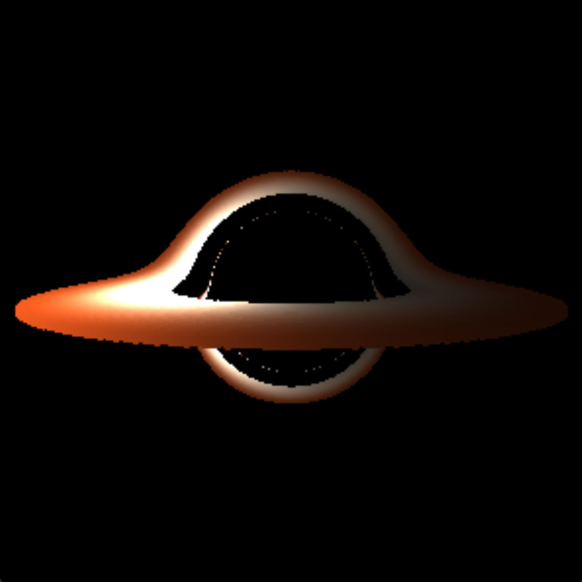

# Schwarzschild-Black-Hole

Black holes distort the nearby gravitational field which causes interesting such as gravitational lensing.

One simplified model of a black hole is the Schwarzschild black hole which assumes it to be spherically symmetric and static. This greatly simplifies the geodesic equations, which are solved to determine the path that matter and light take in the proximty to the black hole. By numerically integrating these equations backwards in time from the perspective of a nearby stationary observer, the origin of the light rays can be deuced to determine their origin. Therefore, an image can be produced, like the one seen above. 

Additonally, a rotating accretion disk around the black hole is modelled. As well as being a feature of black holes, the disk helps illustrate gravitational lensing where light is bent around the black hole. Note, light is bent from the back top and bottom sides of the disk over and below the black hole to the camera which produces the halo effect seen in the picture. Further, light from the front of the disk is bent competely around the black hole which produces a thin ring of light around the dark centre. However, the dark centre within this ring does not actually mark the 'beginning' of the black hole, but the egde of the photon sphere - a region where all light that enters eventually crosses the event horizon. 
